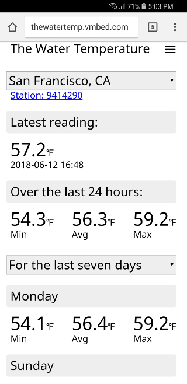

## About

[_The Water Temp_](http://thewatertemp.vmbed.com/) provides an alternate view of water temperature data as provided by [NOAA CO-OPS](https://tidesandcurrents.noaa.gov/stations.html?type=Physical%20Oceanography).

NOAA has a number of monitoring stations throughout the US that collect water temperature data. For a particular station this app will show the latest temperature read and the range of temperatures over 24 hours. For comparison it can also show the temperature ranges for the last seven days or for this day in prior years.

It is designed to work on small screens i.e. phones.

## To Do

* A bit of color would be nice
* Something for larger screens (maybe side by side N station viewing)
* Better error and loading handling
* Maybe some caching
* Search/Filter stations -v- the select/options

## Why?

For more on the mechanics...
